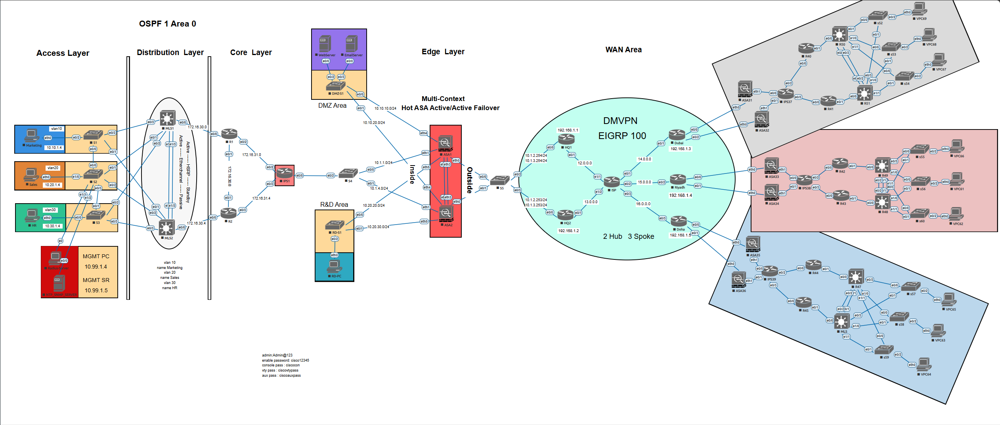
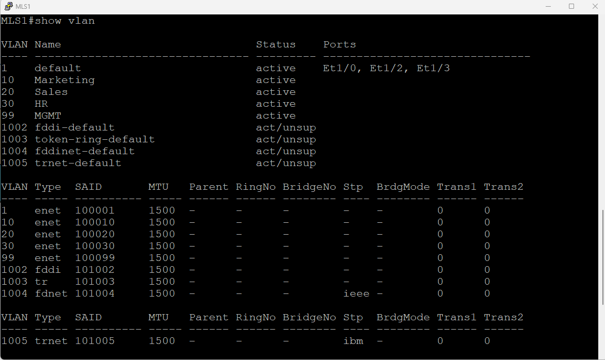
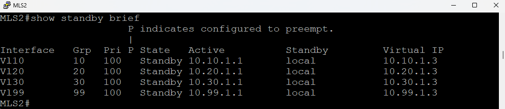
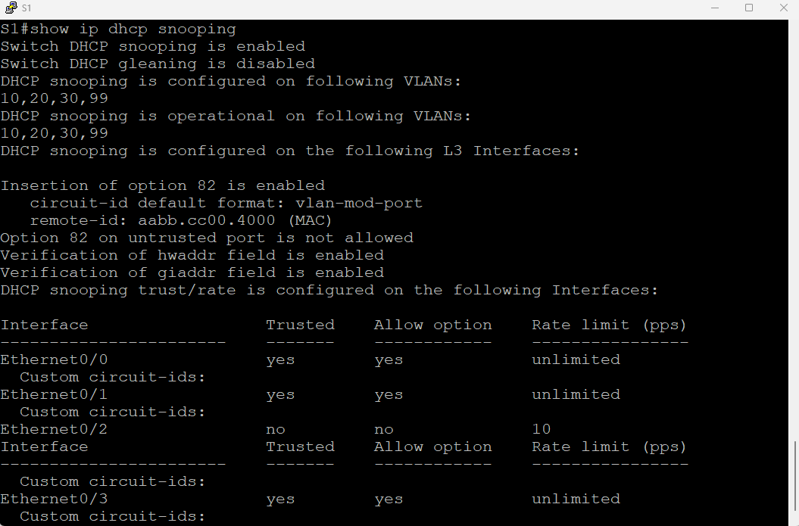
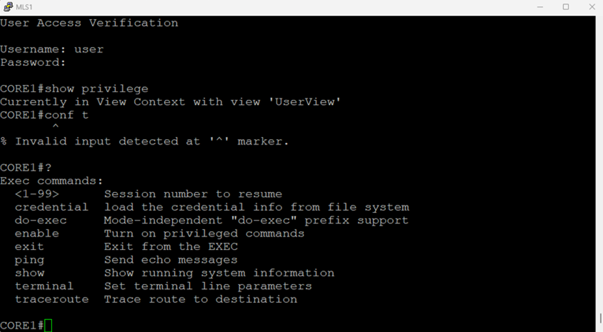
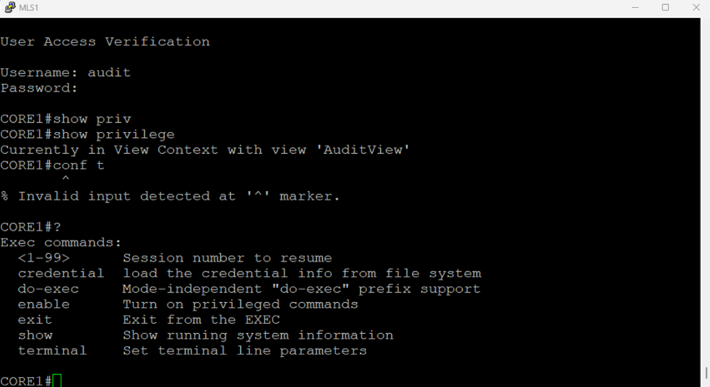
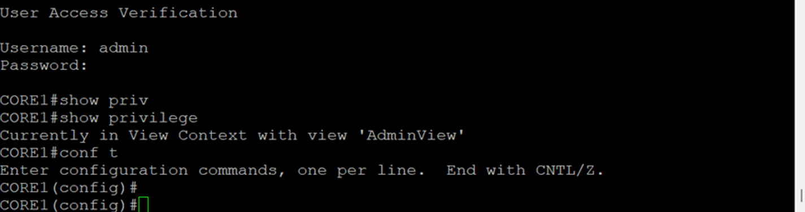

<div align="center">


<br/>

```json
{
  "project"     : "Secure Enterprise Network Infrastructure",
  "simulator"   : "EVE-NG — Academic Lab",
  "status"      : "COMPLETED",
  "controls"    : 18,
  "validated"   : 18,
  "coverage"    : "100%",
  "ips_sigs"    : { "total": 539, "active": 94, "engine": "atomic-ip", "sdf": "S855.0" },
  "sites"       : [ "HQ-Hub1", "HQ-Hub2", "Dubai", "Riyadh", "Doha" ]
}
```

<br/>


</div>

<br/>

```
╔══════════════════════════════════════════════════════════════════════════════╗
║  ARCHITECTURE OVERVIEW                                                       ║
║                                                                              ║
║  [ Internet ] ── [ ASA A/A HA ] ── [ IPS Inline ] ── [ CORE1 / CORE2 ]     ║
║                       |                                      |               ║
║                 [ DMZ / RND ]               [ MLS1 / MLS2 ] ── [ S1/S2/S3 ]║
║                                             [ VLAN 10 / 20 / 30 / 99 ]      ║
║                                                                              ║
║  [ HQ-Hub1 ] ──┐  EIGRP 100                                                 ║
║                ├── [ DMVPN / IPsec ] ── [ Dubai / Riyadh / Doha ]           ║
║  [ HQ-Hub2 ] ──┘  192.168.1.0/24                                            ║
╚══════════════════════════════════════════════════════════════════════════════╝
```

---

## ABOUT

This repository documents a **secure enterprise network infrastructure** I designed and implemented using EVE-NG. The architecture applies a full defense-in-depth model — starting from Layer 2 access port hardening and VLAN isolation, through encrypted multi-site WAN connectivity, inline intrusion prevention, Active/Active firewall high availability, and centralized role-based access control. Every security control was validated with practical evidence.

---

## TABLE OF CONTENTS

**[Highlights](#project-highlights)** · **[Topology](#network-topology)** · **[IP Scheme](#ipv4-address-scheme)** · **[Tech Stack](#technology-stack)** · **[VLANs](#network-segmentation)** · **[Hardening](#layer-2--l3-hardening)** · **[DMVPN](#dmvpn--ipsec)** · **[IPS](#idsips)** · **[Firewall](#asa-firewall-ha)** · **[AAA](#aaa--rbac)** · **[Validation](#validation-matrix)** · **[Structure](#repository-structure)**

---

## PROJECT HIGHLIGHTS

```
┌──────────────────────────┬─────────────────────────────────────────────────────────┐
│  AREA                    │  WHAT WAS BUILT                                         │
├──────────────────────────┼─────────────────────────────────────────────────────────┤
│  VLAN Segmentation       │  4 dept. VLANs, separate broadcast domains, SVI GWs     │
│  L2 / L3 Hardening       │  Port Security, DHCP Snooping, DAI, BPDU/Root/Loop Guard│
│  OSPF Authentication     │  HMAC-SHA-256 keychain — route injection prevented      │
│  Branch VPN              │  Dual-hub DMVPN Phase 2 + AES-256 IPsec + EIGRP 100     │
│  Inline IPS              │  94 active sigs (SDF S855.0) — NULL/SYN-FIN blocked     │
│  Firewall HA             │  ASA 5520 Active/Active, multi-context, NAT, ACLs       │
│  Access Control          │  RADIUS AAA + RBAC parser views — 3 roles enforced      │
└──────────────────────────┴─────────────────────────────────────────────────────────┘
```

---

## NETWORK TOPOLOGY



<details>
<summary><b>[ EXPAND — Zone Trust Model ]</b></summary>

<br/>

```
ZONE               COMPONENTS                               TRUST LEVEL
─────────────────────────────────────────────────────────────────────────
Outside            ISP / Internet-facing interfaces         UNTRUSTED
DMZ                Web server (10.10.10.x), Email (10.10.20.x)  SEMI-TRUSTED
RND                R&D zone (10.20.20.x / 10.20.30.x)      RESTRICTED
Inside             Department VLANs 10 / 20 / 30            TRUSTED
Management         VLAN 99 — 10.99.1.0/24 — admin only      HIGHLY RESTRICTED
DMVPN Overlay      192.168.1.0/24 — encrypted tunnel mesh   ENCRYPTED
```

</details>

---

## IPV4 ADDRESS SCHEME

<details>
<summary><b>[ EXPAND — Full IP Address Table ]</b></summary>

<br/>

| Device | Interface | Network | IP Address | Subnet Mask |
|--------|-----------|---------|------------|-------------|
| **HQ1** | Tunnel1 | 192.168.1.0 | 192.168.1.1 | 255.255.255.0 |
| | E0/0.20 | 10.1.2.0 | 10.1.2.254 | 255.255.255.0 |
| | E0/0.40 | 10.1.3.0 | 10.1.3.254 | 255.255.255.0 |
| | E0/1 | 12.0.0.0 | 12.0.0.1 | 255.255.255.252 |
| **HQ2** | Tunnel1 | 192.168.1.0 | 192.168.1.2 | 255.255.255.0 |
| | E0/0.20 | 10.1.2.0 | 10.1.2.253 | 255.255.255.0 |
| | E0/0.40 | 10.1.3.0 | 10.1.3.253 | 255.255.255.0 |
| | E0/1 | 13.0.0.0 | 13.0.0.1 | 255.255.255.252 |
| **Dubai** | Tunnel1 | 192.168.1.0 | 192.168.1.3 | 255.255.255.0 |
| | E0/1 | 14.0.0.0 | 14.0.0.1 | 255.255.255.252 |
| **Riyadh** | Tunnel1 | 192.168.1.0 | 192.168.1.4 | 255.255.255.0 |
| | E0/2 | 15.0.0.0 | 15.0.0.1 | 255.255.255.252 |
| **Doha** | Tunnel1 | 192.168.1.0 | 192.168.1.5 | 255.255.255.0 |
| | E0/3 | 16.0.0.0 | 16.0.0.1 | 255.255.255.252 |
| **IPS1** | E0/0.10 | 10.1.1.0 | 10.1.1.254 | 255.255.255.0 |
| | E0/0.30 | 10.1.4.0 | 10.1.4.254 | 255.255.255.0 |
| | E0/2 | 172.16.31.0 | 172.16.31.1 | 255.255.255.252 |
| **CORE1** | E0/2 | 172.16.31.0 | 172.16.31.2 | 255.255.255.252 |
| | E0/0 | 172.16.30.0 | 172.16.30.1 | 255.255.255.252 |
| **MLS1** | VLAN10 | 10.10.1.0 | 10.10.1.1 | 255.255.255.192 |
| | VLAN20 | 10.20.1.0 | 10.20.1.1 | 255.255.255.192 |
| | VLAN30 | 10.30.1.0 | 10.30.1.1 | 255.255.255.192 |
| | VLAN99 | 10.99.1.0 | 10.99.1.1 | 255.255.255.0 |
| **MLS2** | VLAN10 | 10.10.1.0 | 10.10.1.2 | 255.255.255.192 |
| | VLAN20 | 10.20.1.0 | 10.20.1.2 | 255.255.255.192 |
| | VLAN30 | 10.30.1.0 | 10.30.1.2 | 255.255.255.192 |
| | VLAN99 | 10.99.1.0 | 10.99.1.2 | 255.255.255.0 |
| **RADIUS** | VLAN99 | 10.99.1.0 | 10.99.1.4 | 255.255.255.0 |
| **Web Server** | E0/0.50 | 10.10.10.0 | 10.10.10.254 | 255.255.255.0 |
| **Email Server** | E0/0.60 | 10.10.20.0 | 10.10.20.254 | 255.255.255.0 |

**ASA Firewall Contexts:**

| ASA | Context | Zone | Interface | IP |
|-----|---------|------|-----------|-----|
| ASA1 (Active C1) | C1 | Outside | E0.20 | 10.1.2.1 |
| | | Inside | E1.10 | 10.1.1.1 |
| | | DMZ | E4.50 | 10.10.10.1 |
| | | RND | E5.70 | 10.20.20.1 |
| ASA1 (Standby C2) | C2 | Outside | E0.40 | 10.1.3.2 |
| | | Inside | E1.30 | 10.1.4.2 |

**NAT Address Map:**

| Context | Static NAT (DMZ) | Dynamic PAT |
|---------|-----------------|-------------|
| C1 | 10.1.2.100 (Web), 10.1.2.101 (Email) | 10.1.2.1 |
| C2 | 10.1.3.100 (Web), 10.1.3.101 (Email) | 10.1.3.1 |

</details>

---

## TECHNOLOGY STACK

| Layer | Technology | Role |
|-------|-----------|------|
| **Routing** | Cisco IOS Routers | HQ hubs, branch spoke routers |
| **Switching** | Cisco L2/L3 Switches (MLS1/MLS2/S1/S2/S3) | VLAN segmentation, STP hardening, SVIs |
| **Firewall** | Cisco ASA 5520 | Zone-based filtering, NAT, Active/Active HA |
| **IPS** | Cisco IOS IPS (SDF S855.0) | Inline prevention — 94 active signatures |
| **VPN** | DMVPN Phase 2 + IPsec (AES-256) | Encrypted site-to-site overlay |
| **Routing Protocol** | EIGRP AS 100 / OSPF Area 0 | Tunnel routing and internal routing |
| **Authentication** | RADIUS (10.99.1.4, ports 1812/1813) | Centralized AAA |
| **Management** | SSH v2 | Encrypted remote CLI access |
| **Registration** | NHRP | Spoke dynamic registration in DMVPN |
| **Simulator** | EVE-NG | Lab environment |

---

## NETWORK SEGMENTATION

Each department is isolated in a dedicated VLAN — its own broadcast domain. Inter-VLAN routing is enforced at the MLS1/MLS2 Layer 3 boundary via ACL policy. No department reaches another without explicit permission.

| VLAN | Department | Subnet | Gateway (SVI) | Posture |
|------|-----------|--------|---------------|---------|
| **10** | Marketing | `10.10.1.0/26` | `10.10.1.3` (HSRP) | Isolated by default |
| **20** | Sales | `10.20.1.0/26` | `10.20.1.3` (HSRP) | Isolated by default |
| **30** | HR | `10.30.1.0/26` | `10.30.1.3` (HSRP) | Isolated by default |
| **99** | Management | `10.99.1.0/24` | `10.99.1.3` (HSRP) | Admin access only |

**VLAN Database:**



**SVI & Gateway Verification:**



---

## LAYER 2 / L3 HARDENING

### Switch-Level Controls

| Control | Attack Mitigated | Enforcement |
|---------|-----------------|-------------|
| **Port Security** | MAC flooding, rogue devices | Sticky MAC; restrict mode; err-disables on violation |
| **DHCP Snooping** | Rogue DHCP, starvation | Trusted uplinks only; rate limit 10 pps on untrusted ports |
| **Dynamic ARP Inspection (DAI)** | ARP spoofing, MITM | Validates ARP against DHCP snooping binding table |
| **BPDU Guard** | Unauthorized switches | Err-disables access port on any BPDU received |
| **Root Guard** | Rogue STP root election | Port → root-inconsistent on superior BPDU |
| **Loop Guard** | STP failure loops | Port → loop-inconsistent if BPDUs stop arriving |
| **Rate Limiting** | DHCP flooding, L2 DoS | `ip dhcp snooping limit rate 10` on untrusted ports |
| **STP Root Planning** | Topology manipulation | Manual priority: MLS1 primary, MLS2 secondary per VLAN |

### Routing Plane Controls

```
  OSPF HMAC-SHA-256  →  Key-chain "GTS" applied on all OSPF interfaces
                         Prevents route injection and adjacency spoofing
  RFC1918 ACLs       →  Applied inbound on CORE1 E0/2 (WAN-facing)
                         Denies 10.0.0.0/8, 172.16.0.0/12, 192.168.0.0/16 from outside
  SSH v2             →  timeout 90s, retries 2, domain GTS.net
                         Telnet fully disabled across all devices
```

**DHCP Snooping Validation:**



**Dynamic ARP Inspection Validation:**


---

## DMVPN / IPsec

**Dual-hub DMVPN Phase 2** connects HQ to three regional branches over an AES-256 encrypted overlay with automatic failover. Tunnel space: `192.168.1.0/24`.

### Site Roles

| Site | Tunnel IP | Role | WAN Interface |
|------|-----------|------|---------------|
| **HQ-Hub1** | 192.168.1.1 | Primary Hub / NHRP Server | E0/1 — 12.0.0.1 |
| **HQ-Hub2** | 192.168.1.2 | Secondary Hub / NHRP Server | E0/1 — 13.0.0.1 |
| **Dubai** | 192.168.1.3 | Spoke | E0/1 — 14.0.0.1 |
| **Riyadh** | 192.168.1.4 | Spoke | E0/2 — 15.0.0.1 |
| **Doha** | 192.168.1.5 | Spoke | E0/3 — 16.0.0.1 |

### Crypto Parameters

```
  IKE Phase 1 (ISAKMP)
  ├── Encryption   : AES-256
  ├── Hash         : MD5
  ├── Auth         : Pre-Shared Key (cisco123)
  └── DH Group     : 2

  IKE Phase 2 (IPsec)
  ├── Transform    : ESP-AES-256 + ESP-MD5-HMAC
  ├── Mode         : Transport
  └── Profile      : DMVPN-PROFILE

  NHRP
  ├── Network-ID   : 1
  ├── Hubs         : NHS 192.168.1.1 (12.0.0.1) + NHS 192.168.1.2 (13.0.0.1)
  └── Shortcut     : Enabled (spoke-to-spoke)

  EIGRP AS 100
  └── Advertises tunnel + loopback networks across all sites
```

### Failover Design

```
  Spoke → maintains sessions to BOTH hubs simultaneously
  Hub1 failure → EIGRP reconverges → spoke re-registers to Hub2
  No manual intervention required
```

**DMVPN & NHRP Validation** — All spokes registered as Dynamic (D) peers:


---

## IDS/IPS

A **Cisco IOS IPS** deployed **inline** (`ip ips iosips in`) on all critical interfaces of the dedicated IPS device. Traffic is inspected before entering internal routing domains.

### Signature Engine

```
  Cisco SDF Version   : S855.0
  Micro-Engine        : atomic-ip
  Total Signatures    : 539
  Active Signatures   : 94
  Retired             : 517  (reduces CPU load)
  Compiled            : 22
  Notification        : SDEE + Syslog
```

### Tuned Signatures

| Sig ID | Threat | Action |
|--------|--------|--------|
| **3040** | TCP NULL Packet | `produce-alert` + `deny-packet-inline` |
| **3041** | TCP SYN/FIN Packet | `produce-alert` + `deny-packet-inline` |
| **2004** | ICMP Echo Request | `produce-alert` only (not dropped — service continuity) |

### Validation Method

```
  1. Clear IPS counters → establish clean baseline
  2. Confirm ip ips iosips in applied on all interfaces
  3. Run Zenmap/Nmap scan from 10.99.1.4 → target 10.1.1.254
  4. Observe %IPS-4-SIGNATURE alerts for sig 3040/3041
  5. Check show ip ips statistics → drop counters incremented
  6. Verify ICMP still passes (sig 2004 alert-only, drop = 0)
```

**IPS Alerts & Inline Drop Evidence:**


---

## ASA FIREWALL HA

**Cisco ASA 5520** firewalls in **multi-context mode** with **Active/Active failover** — both units process traffic simultaneously with instant role promotion on failure.

### Security Zone Policy

| Zone | Security Level | Traffic Treatment |
|------|---------------|------------------|
| **Outside** | 0 — Untrusted | All inbound filtered by ACL |
| **DMZ** | 50 — Semi-trusted | Web/Email reachable via Static NAT |
| **RND** | 60 — Restricted | Tightly controlled ACL |
| **Inside** | 100 — Trusted | Outbound via Dynamic PAT |

### Failover Architecture

```
  ASA1 (Primary)   → Failover Group 1: Active   / Failover Group 2: Standby Ready
  ASA2 (Secondary) → Failover Group 1: Standby  / Failover Group 2: Active

  Failover Link    : FOVER Ethernet2
  Stateful Link    : FOVER_LINK Ethernet3
  Heartbeat        : 1s poll / 15s holdtime (unit) | 5s poll / 25s holdtime (interface)
```

### Key Config Details

```
  Contexts         : C1 (Group 1) + C2 (Group 2)
  Static NAT C1    : 10.1.2.100 → Web, 10.1.2.101 → Email
  Dynamic PAT C1   : Inside ALL → 10.1.2.1 (outside interface)
  Object Groups    : OBJ_INSIDE_ALL, OBJ_WEB_C1, OBJ_MAIL_C1, SVC_WEB, SVC_EMAIL
  ACL placement    : OUTSIDE_IN on outside, DMZ_OUT_C1 on dmz
```

**ASA Failover Validation** — Standby promoted after active shutdown:


---

## AAA / RBAC

**RADIUS** (GTS-RADIUS at `10.99.1.4`, ports 1812/1813) provides centralized authentication. **Cisco CLI parser views** enforce role-based command access across all devices. Local fallback maintains service if RADIUS is unreachable.

### AAA Method Lists

```
  aaa new-model
  aaa authentication login default      local-case group radius
  aaa authentication login SSH_AUTH     local-case group radius
  aaa authorization  exec    default    local      group radius
  aaa authorization  exec    SSH_AUTH   local      group radius
  aaa accounting     exec    default    start-stop group radius

  VTY lines → transport input ssh | login/auth SSH_AUTH | authz exec SSH_AUTH
```

### RBAC Role Definitions

| Role | View | Privilege | Commands Permitted |
|------|------|-----------|-------------------|
| **admin** | AdminView | Level 15 | `configure terminal`, all `show`, all `debug` |
| **audit** | AuditView | Read-only | `show logging`, `show running-config`, `show privilege`, `show` |
| **user** | UserView | Restricted | `ping`, `traceroute`, `terminal monitor`, selected `show` |

### Auth Flow

```
  SSH Login
      │
      ▼
  RADIUS (10.99.1.4:1812) ── Authenticates credentials
      │                       Falls back to local-case if unreachable
      ▼
  Parser View assigned ────── Commands filtered to role scope
      │
      ▼
  CLI Session ─────────────── Access enforced
```

**UserView — Restricted (conf t denied):**



**AuditView — Read-Only (conf t denied):**



**AdminView — Full Access (conf t permitted):**



---

## VALIDATION MATRIX

| # | Control | Test Performed | Result |
|---|---------|---------------|--------|
| 01 | VLAN Segmentation | Cross-VLAN ping without ACL permit | PASS |
| 02 | Port Security | Unknown MAC connected to access port e0/0 on S3 | PASS — restrict violation, traffic dropped |
| 03 | DHCP Snooping | Rogue DHCP server on untrusted port | PASS — offer dropped |
| 04 | Dynamic ARP Inspection | Forged ARP reply injected | PASS — packet dropped |
| 05 | BPDU Guard | BPDU sent on access port Et1/0 | PASS — err-disabled (bpduguard) |
| 06 | Root Guard | Superior BPDU on uplink trunk | PASS — root-inconsistent state |
| 07 | OSPF SHA-256 Auth | Unauthenticated routing update sent | PASS — adjacency rejected |
| 08 | RFC1918 ACL | Spoofed private IP from WAN interface | PASS — dropped by RFC1918-IN ACL |
| 09 | DMVPN Connectivity | Ping HQ-Hub1 → ISP, Dubai (14.0.0.1) | PASS — 100% success rate |
| 10 | NHRP Registration | `show dmvpn` on Hub1 Tunnel1 | PASS — Dubai/Riyadh/Doha shown as Dynamic (D) |
| 11 | IPsec Phase 1 | `show crypto isakmp sa` | PASS — all peers QM_IDLE |
| 12 | IPsec Phase 2 | `show crypto ipsec sa` — packet counters | PASS — encrypt/decrypt counters increasing |
| 13 | IPS Sig 3040 | TCP NULL scan from 10.99.1.4 | PASS — alert + inline drop confirmed |
| 14 | IPS Sig 3041 | TCP SYN/FIN scan from 10.99.1.4 | PASS — alert + inline drop confirmed |
| 15 | IPS Continuity | ICMP after scan (sig 2004) | PASS — alert only, drop counter = 0 |
| 16 | ASA Failover | Active ASA shutdown forced | PASS — secondary assumed active role |
| 17 | Static NAT | Outside → DMZ 10.1.2.100 (web) | PASS — XLATE hit confirmed post-failover |
| 18 | Dynamic PAT | Inside → Outside (Sales ping 192.168.1.1) | PASS — PAT translation in XLATE table |
| 19 | Zone ACL — Outside→Inside | Ping from HQ-Hub1 to 10.20.1.4 | PASS — 0% success (denied) |
| 20 | Zone ACL — Inside→Outside | Ping from Sales to 192.168.1.1 | PASS — 100% success (permitted) |
| 21 | Zone ACL — DMZ→Inside | Ping from WebServer to 10.20.1.4 | PASS — 0% success (denied) |
| 22 | AAA UserView | Login as `user` — attempt `conf t` | PASS — invalid input, denied |
| 23 | AAA AuditView | Login as `audit` — attempt `conf t` | PASS — invalid input, denied |
| 24 | AAA AdminView | Login as `admin` — attempt `conf t` | PASS — entered config mode |

<div align="center">

```
╔══════════════════════════════════════════╗
║   24 / 24 PASSED      COVERAGE  100%    ║
╚══════════════════════════════════════════╝
```

</div>

---

## REPOSITORY STRUCTURE

```
defense-in-depth-lab/
│
├── README.md
├── LICENSE
│
├── configs/               ← Device configuration files
│   
│
└── diagrams//                ← All screenshots (see below)
│    ├── topology.png
│    ├── vlan-database.png
│    ├── svi-configuration.png
│    ├── dhcp-snooping.png
│    ├── dai-validation.png
│    ├── dmvpn-validation.png
│    ├── ips-alerts.png
│    ├── asa-failover.png
│    ├── aaa-rbac-validation1.png
│    ├── aaa-rbac-validation2.png
│    └── aaa-rbac-validation3.png
│
├── docs/                 
│
├── tests/                

```

---

<div align="center">


[](https://github.com/0xcgz)

</div>
